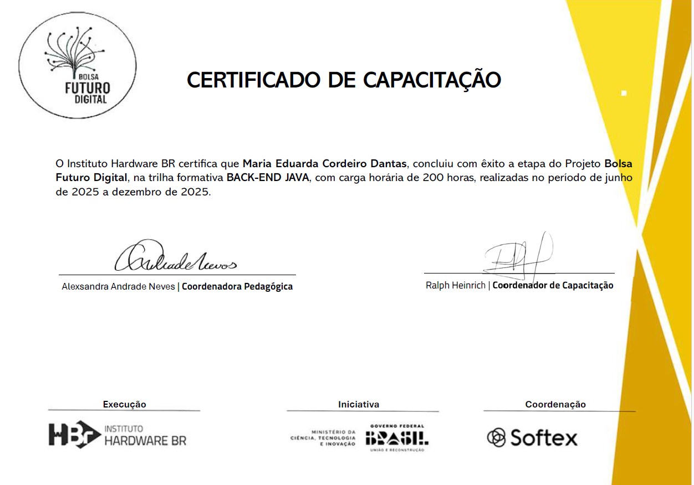

# 🧠 Daily Java Challenges (Gerador Automático de Desafios)

Este projeto é uma extensão do meu repositório de estudos em Java (**ExerciciosJava**) focado em backend e prática contínua. Aqui criei um **sistema automatizado de geração de desafios diários de programação** em Java, que aprende com seu progresso e oferece exercícios cada vez mais realistas e relevantes para quem quer dominar **Java Backend e Spring Boot**.

## Objetivo

O Daily Java Challenges tem como objetivo:

- Gerar **desafios de programação em Java todos os dias**
- Adaptar a dificuldade do desafio ao nível de conhecimento do usuário
- Expor problemas realistas e contextualizados com backend Java
- Integrar **IA (Groq API)** para criar enunciados variados automaticamente
- Automatizar tudo via **GitHub Actions** para funcionamento contínuo

Este projeto não é apenas uma lista fixa de exercícios — é uma máquina de desafios que cresce com você. 

## Como funciona

### Automação diária

- Um workflow do **GitHub Actions** roda todo dia às 06:00 (UTC)
- Ele executa um script Python (`scripts/generate_challenge.py`)
- O script calcula seu nível atual e chama a **Groq API** para gerar um novo enunciado
- Cria um arquivo `.java` com um nome único e o conteúdo com o desafio do dia
- Faz commit e push automática no repositório


## Controle de nível

O progresso do usuário é armazenado em `nivel.json`:

- `"nivel_atual"`: iniciante → intermediario → avancado
- `"exercicios_desde_analise"`: conta quantos desafios já foram gerados naquele nível
- `"ultima_analise"`: data da última avaliação

Quando o contador chega em 30, o script atualiza automaticamente o nível.  
Você pode apagar o arquivo se quiser **resetar o progresso**, pois o script recria tudo automaticamente caso ele não exista.

## Geração dos desafios com IA

O script usa a **Groq API** para gerar o enunciado de maneira inteligente e alinhada com o nível:

- O prompt para IA é adaptado para cada nível
- Níveis mais altos geram desafios mais realistas e ligados a backend
- A saída é um JSON estruturado com:
    - Título do desafio
    - Enunciado
    - Requisitos
    - Exemplos de entrada e saída

O script valida o JSON antes de criar o arquivo `.java`.

## Níveis de desafio

### 🟢 Iniciante
Desafios simples, lógica básica e saídas no console — com contexto real.

### 🟡 Intermediário
Foco em **Java Backend com Spring Boot**:
- APIs REST funcionais
- Controllers, Services, DTOs
- Separação de camadas
- Regras de negócio realistas

### 🔴 Avançado
Problemas com foco em:
- Design de software
- Arquitetura de projeto
- Escalabilidade
- Padrões de projeto

## 🛠 Instalação & Execução

### Pré-requisitos
- Git
- Python 3.x
- Conta e chave de API Groq (configurada no GitHub como `GROQ_API_KEY`)

### Como rodar localmente

```bash
git clone https://github.com/${seu_usuario}/ExerciciosJava
cd ExerciciosJava
pip install requests
python scripts/generate_challenge.py 
```

---
---

# Estudos para Residência em Java
Este repositório reúne meus estudos e práticas em **Linguagem de Programção em JAVA** realizados durante o 𝐏𝐫𝐨𝐠𝐫𝐚𝐦𝐚 𝐝𝐞 𝐑𝐞𝐬𝐢𝐝𝐞̂𝐧𝐜𝐢𝐚 𝐁𝐚𝐜𝐤𝐞𝐧𝐝 𝐞𝐦 𝐉𝐚𝐯𝐚, oferecido pelo Instituto Federal de Educação, Ciência e Tecnologia de São Paulo - IFSP em parceria com a HBR - Instituto Hardware BR!
Foram seis meses de aprendizado com foco em 𝐞𝐧𝐭𝐫𝐞𝐠𝐚 𝐫𝐞𝐚𝐥 𝐞 𝐩𝐫𝐨𝐛𝐥𝐞𝐦𝐚𝐬 𝐫𝐞𝐚𝐢𝐬 𝐝𝐞 𝐦𝐞𝐫𝐜𝐚𝐝𝐨. Meus sinceros agradecimentos ao instrutor **Kesede Rodrigues Julio** pelo apoio! [Linkedin](https://www.linkedin.com/in/kesedejulio/).

## Conteúdo do Repositório
- **Métodos**
    - 20 exercícios resolvidos com enunciado e minha solução.

- **Residencia.Vetores**
    - 50 exercícios resolvidos com enunciado e minha solução.

- **Coleções**
    - 6 exercícios planejados (ainda não iniciados — podem surgir mais).

- **Residencia.POO (Programação Orientada a Objetos)**
    - 36 exercícios resolvidos com enunciado e minha solução.

- **Tratamento de Erros**
    - 5 exercícios planejados (ainda não iniciados).

- **Exercícios Aplicados**
    - 2 exercícios resolvidos com enunciado e minha solução.

- **Exercícios Externos (Bootcamp DIO - JAVA)**
    - 12 exercícios planejados do bootcamp DIO (ainda não iniciados).

- **Hackathons**
    - 4 hackathons planejados.

- **Projetos Externos(Bootcamp DIO - JAVA)**
    - 3 projetos planejados (ainda não iniciados).

---

## Sobre os Exercícios Resolvidos

Todos os exercícios concluídos neste repositório contêm:
- O enunciado original
- A minha resolução completa

---

##  Objetivo

Esse repositório serve como um registro do meu progresso e aprendizado em Java, e também como um portfólio de referência para futuros projetos.

---

📍 *Desenvolvido com dedicação por [DantinhasMD](https://github.com/DantinhasMD)* ☕
---
